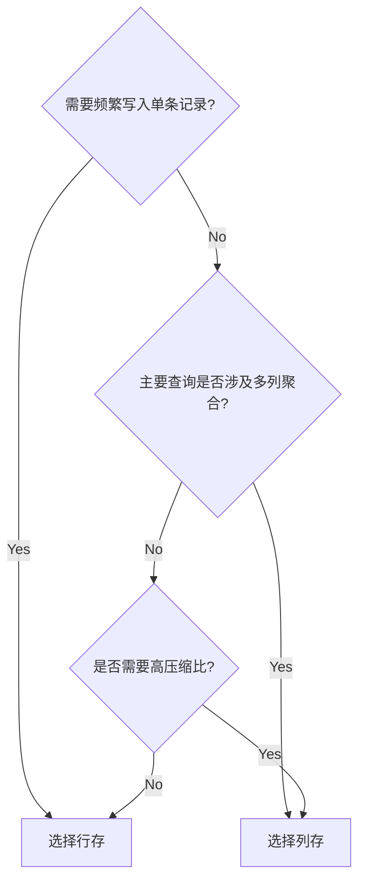

# 1. golang 发布订阅，代码实现
- 以下是参考答案
    - 注意点： copy的做哟过
```
package main

import (
	"fmt"
	"sync"
	"time"
)

type PubSub struct {
	mu          sync.RWMutex
	subscribers map[string][]chan interface{}
}

func NewPubSub() *PubSub {
	return &PubSub{
		subscribers: make(map[string][]chan interface{}),
	}
}

func (ps *PubSub) Subscribe(topic string) (<-chan interface{}, func()) {
	ch := make(chan interface{}, 10) // 带缓冲的channel
	ps.mu.Lock()
	ps.subscribers[topic] = append(ps.subscribers[topic], ch)
	ps.mu.Unlock()

	// 返回取消订阅的函数
	return ch, func() {
		ps.mu.Lock()
		defer ps.mu.Unlock()
		subs := ps.subscribers[topic]
		for i, sub := range subs {
			if sub == ch {
				// 移除channel并保持顺序
				subs = append(subs[:i], subs[i+1:]...)
				close(ch)
				ps.subscribers[topic] = subs
				return
			}
		}
	}
}

func (ps *PubSub) Publish(topic string, msg interface{}) {
	ps.mu.RLock()
	defer ps.mu.RUnlock()

	subs, exists := ps.subscribers[topic]
	if !exists {
		return
	}

	// 创建副本避免锁竞争
	currentSubs := make([]chan interface{}, len(subs))
	copy(currentSubs, subs)

	// 异步发送消息
	for _, ch := range currentSubs {
		go func(c chan interface{}) {
			defer func() {
				if recover() != nil {
					// channel已关闭
				}
			}()
			select {
			case c <- msg:
			default:
				// 消息未处理（channel满）
			}
		}(ch)
	}
}

// 使用示例
func main() {
	ps := NewPubSub()

	// 订阅者1
	ch1, cancel1 := ps.Subscribe("news")
	go func() {
		for msg := range ch1 {
			fmt.Printf("Subscriber1 received: %v\n", msg)
		}
		fmt.Println("Subscriber1退出")
	}()

	// 订阅者2
	ch2, _ := ps.Subscribe("news")
	go func() {
		for msg := range ch2 {
			fmt.Printf("Subscriber2 received: %v\n", msg)
		}
		fmt.Println("Subscriber2退出")
	}()

	// 发布消息
	ps.Publish("news", "Breaking News: Go 1.20 released!")
	ps.Publish("news", "Update: New features announced")

	// 取消订阅者1
	time.Sleep(100 * time.Millisecond)
	cancel1()

	// 发布后续消息
	ps.Publish("news", "Late News: Performance improvements")

	time.Sleep(100 * time.Millisecond)
}
```
## copy
# 2. 使用context关闭3个嵌套的子协程，代码实现

```go
package main

import (
	"context"
	"fmt"
	"time"
)

func main() {
	// 创建可取消的context
	ctx, cancel := context.WithCancel(context.Background())
	defer cancel()

	// 启动父协程
	go parent(ctx)

	// 主程序等待3秒后触发取消
	time.Sleep(3 * time.Second)
	fmt.Println("\n==== 发送取消信号 ====")
	cancel()

	// 等待协程退出
	time.Sleep(500 * time.Millisecond)
}

// 父协程
func parent(ctx context.Context) {
	// 启动两个子协程
	go child(ctx, "child-1")
	go child(ctx, "child-2")

	// 父协程的工作循环
	for {
		select {
		case <-ctx.Done():
			fmt.Println("[parent] 收到取消信号")
			return
		default:
			fmt.Println("[parent] 正在工作...")
			time.Sleep(500 * time.Millisecond)
		}
	}
}

// 子协程
func child(ctx context.Context, name string) {
	// 启动孙子协程
	go grandchild(ctx, name+"/grandchild")

	// 子协程的工作循环
	for {
		select {
		case <-ctx.Done():
			fmt.Printf("[%s] 收到取消信号\n", name)
			return
		default:
			fmt.Printf("[%s] 正在工作...\n", name)
			time.Sleep(300 * time.Millisecond)
		}
	}
}

// 孙子协程
func grandchild(ctx context.Context, name string) {
	// 孙子协程的工作循环
	for {
		select {
		case <-ctx.Done():
			fmt.Printf("[%s] 收到取消信号\n", name)
			return
		default:
			fmt.Printf("[%s] 正在工作...\n", name)
			time.Sleep(200 * time.Millisecond)
		}
	}
}
```
# 3. 如何确定 channel 关闭了，代码实现
```go
package main

import (
	"fmt"
	"time"
)

// 方法1：使用 for-range 自动检测关闭
func consumer1(ch <-chan int) {
	for v := range ch {
		fmt.Printf("Consumer1 收到: %d\n", v)
	}
	fmt.Println("Consumer1 检测到 channel 关闭")
}

// 方法2：使用 ok 标识符显式检测
func consumer2(ch <-chan int) {
	for {
		v, ok := <-ch
		if !ok {
			fmt.Println("Consumer2 检测到 channel 关闭")
			return
		}
		fmt.Printf("Consumer2 收到: %d\n", v)
	}
}

// 方法3：非阻塞检测（需要配合关闭通知）
func consumer3(ch <-chan int, done chan struct{}) {
	for {
		select {
		case v, ok := <-ch:
			if !ok {
				fmt.Println("Consumer3 检测到 channel 关闭")
				close(done)
				return
			}
			fmt.Printf("Consumer3 收到: %d\n", v)
		default:
			// 非阻塞模式下的其他处理
			time.Sleep(100 * time.Millisecond)
		}
	}
}

func main() {
	// 示例1：基础检测
	ch1 := make(chan int, 3)
	go func() {
		ch1 <- 1
		ch1 <- 2
		close(ch1)
	}()
	go consumer1(ch1)

	// 示例2：显式检测
	ch2 := make(chan int, 2)
	go func() {
		ch2 <- 3
		ch2 <- 4
		close(ch2)
	}()
	go consumer2(ch2)

	// 示例3：非阻塞检测
	ch3 := make(chan int)
	done := make(chan struct{})
	go func() {
		time.Sleep(500 * time.Millisecond) // 模拟延迟关闭
		close(ch3)
	}()
	go consumer3(ch3, done)

	// 等待所有示例完成
	time.Sleep(1 * time.Second)
	<-done
}
```
# 4. 写出常用的 docker 命令，不少于 10 个
```shell
#!/bin/bash
##############################################
### 常用 Docker 命令集（带注释说明版） ###
##############################################

#--------------------------
# 容器操作
#--------------------------

# 1. 启动Nginx容器（后台运行+端口映射）
docker run -d --name my_container -p 8080:80 nginx:latest

# 2. 查看所有容器（含已停止的）
docker ps -a

# 3. 停止运行中的容器
docker stop my_container

# 4. 强制删除运行中的容器
docker rm -f my_container


#--------------------------
# 镜像管理
#--------------------------

# 5. 拉取Ubuntu 20.04镜像
docker pull ubuntu:20.04

# 6. 构建自定义镜像（当前目录Dockerfile）
docker build -t my_image:1.0 .

# 7. 删除指定镜像（危险操作！）
docker rmi my_image:1.0


#--------------------------
# 日志监控
#--------------------------

# 8. 实时追踪容器日志（最后100行）
docker logs -f --tail 100 my_container

# 9. 监控容器资源使用
docker stats


#--------------------------
# 容器交互
#--------------------------

# 10. 进入容器bash终端
docker exec -it my_container /bin/bash

# 11. 执行单条命令
docker exec my_container ls /app


#--------------------------
# 网络管理
#--------------------------

# 12. 创建自定义桥接网络
docker network create my_bridge

# 13. 查看网络详情
docker inspect my_network


#--------------------------
# 数据卷操作
#--------------------------

# 14. 创建持久化数据卷
docker volume create my_volume

# 15. 挂载数据卷到容器
docker run -v my_volume:/app/data my_image


#--------------------------
# 系统管理
#--------------------------

# 16. 查看容器IP地址
docker inspect my_container | grep IPAddress

# 17. 宿主机与容器文件互传
docker cp my_container:/path/file.txt ./
docker cp ./file.txt my_container:/path/

# 18. 清理无用资源（危险！）
docker system prune -a


#--------------------------
# 组合操作
#--------------------------

# 19. 批量停止所有运行中的容器
docker stop $(docker ps -q)

# 20. 删除所有已停止容器
docker container prune


##############################################
### 推荐别名配置（添加到~/.bashrc） ###
##############################################

# 格式化容器列表查看
alias dps='docker ps --format "table {{.ID}}\t{{.Names}}\t{{.Status}}\t{{.Ports}}"'

# 格式化镜像列表查看
alias dimg='docker images --format "table {{.ID}}\t{{.Repository}}\t{{.Tag}}\t{{.Size}}"'

# 快速进入容器
dsh() { docker exec -it $1 /bin/bash; }

# 带日志时间的容器查看
dlogs() { docker logs -f --since=10s $1; }
```
# 5. k8s 中存储有几种挂载方式
Kubernetes 中主要有以下几种存储挂载方式，每种方式都有不同的适用场景和特点：

---

### **一、临时存储卷（Ephemeral Volumes）**
#### 1. **emptyDir**
- **用途**：Pod 内容器之间共享临时数据
- **生命周期**：与 Pod 生命周期一致（Pod 删除后数据丢失）
- **适用场景**：临时缓存、中间计算结果共享
- **示例配置**：
  ```yaml
  volumes:
    - name: cache-volume
      emptyDir: {}
  ```

#### 2. **hostPath**
- **用途**：将节点（Node）的文件系统挂载到 Pod
- **生命周期**：与节点生命周期一致（Pod 删除后数据保留在节点）
- **风险**：可能导致节点间数据不一致
- **适用场景**：开发调试、访问节点特定文件（如 Docker 内部文件）
- **示例配置**：
  ```yaml
  volumes:
    - name: node-log
      hostPath:
        path: /var/log
  ```

---

### **二、持久化存储卷（Persistent Volumes）**
#### 1. **PersistentVolume (PV) / PersistentVolumeClaim (PVC)**
- **核心概念**：
  - **PV**：集群级别的存储资源（由管理员创建）
  - **PVC**：用户对存储资源的请求（绑定到 PV）
- **生命周期**：独立于 Pod（数据持久化）
- **支持后端存储**：
  - 云存储（AWS EBS、Azure Disk、GCE PD）
  - 网络存储（NFS、Ceph、GlusterFS）
  - 本地存储（Local Volume）
- **示例配置**：
  ```yaml
  # PVC 定义
  kind: PersistentVolumeClaim
  apiVersion: v1
  metadata:
    name: my-pvc
  spec:
    accessModes: [ "ReadWriteOnce" ]
    resources:
      requests:
        storage: 10Gi

  # Pod 挂载
  volumes:
    - name: data
      persistentVolumeClaim:
        claimName: my-pvc
  ```

#### 2. **StorageClass（动态供给）**
- **用途**：动态按需创建 PV
- **优势**：无需手动创建 PV，自动绑定 PVC
- **示例配置**：
  ```yaml
  # StorageClass 定义（AWS EBS）
  kind: StorageClass
  apiVersion: storage.k8s.io/v1
  metadata:
    name: fast
  provisioner: kubernetes.io/aws-ebs
  parameters:
    type: gp3
  ```

---

### **三、特殊用途卷**
#### 1. **ConfigMap / Secret**
- **用途**：挂载配置文件和敏感数据
- **特点**：
  - **ConfigMap**：存储非敏感配置（如环境变量、配置文件）
  - **Secret**：存储敏感数据（如密码、密钥）
- **示例配置**：
  ```yaml
  volumes:
    - name: app-config
      configMap:
        name: my-configmap
    - name: db-secret
      secret:
        secretName: mysql-secret
  ```

#### 2. **Projected Volume**
- **用途**：将多个数据源（Secret/ConfigMap/DownwardAPI）合并挂载到同一目录
- **示例配置**：
  ```yaml
  volumes:
    - name: combined-volume
      projected:
        sources:
        - secret:
            name: db-secret
        - configMap:
            name: app-config
  ```

---

### **四、高级挂载方式**
#### 1. **CSI (Container Storage Interface)**
- **用途**：支持第三方存储插件（如云厂商的专有存储）
- **优势**：解耦 Kubernetes 与存储系统，扩展性强
- **典型插件**：AWS EBS CSI Driver、Azure Disk CSI Driver

#### 2. **Ephemeral CSI Volumes**
- **用途**：临时卷的 CSI 实现（如 emptyDir 的增强版）
- **场景**：需要临时存储但希望使用 CSI 驱动（如加密的临时卷）

---

### **五、挂载方式对比**
| 类型             | 数据持久性 | 典型场景                     | 运维复杂度 |
|------------------|------------|------------------------------|------------|
| emptyDir         | 临时       | 缓存、临时计算               | 低         |
| hostPath         | 持久*      | 节点日志采集、开发调试       | 中         |
| PV/PVC           | 持久       | 数据库、应用状态持久化       | 高         |
| ConfigMap/Secret | 配置       | 应用配置、密钥管理           | 低         |
| CSI              | 持久/临时  | 企业级存储扩展               | 高         |

---

### **最佳实践建议**
1. **生产环境优先使用 PVC + StorageClass**  
   ```yaml
   # 动态分配存储示例
   volumeClaimTemplates:
     - metadata:
         name: data
       spec:
         accessModes: [ "ReadWriteOnce" ]
         storageClassName: "fast"
         resources:
           requests:
             storage: 100Gi
   ```

2. **避免使用 hostPath**  
   - 仅在调试或单节点环境使用，集群环境易导致数据不一致。

3. **敏感数据必须用 Secret**  
   - 通过加密存储卷（如 CSI 驱动的加密卷）增强安全性。

4. **临时数据选择 emptyDir**  
   - 设置大小限制防止磁盘耗尽：
     ```yaml
     emptyDir:
       sizeLimit: 500Mi
     ```

通过合理选择存储挂载方式，可以在保证数据安全性和可用性的同时，满足不同业务场景的需求。


# 6. 分布式系统发生故障，如何排查
以下是分布式系统故障排查的标准化流程和实用指南，按照优先级排序的排查步骤：

---

### **一、紧急响应阶段**
#### 1. 服务状态速查
```bash
# 快速确认核心服务状态（示例）
kubectl get pods -n production | grep -E 'web|api|db'
curl -I https://api.example.com/healthcheck
```

#### 2. 影响范围评估
- 确认故障特征：
  - 全区域不可用 vs 局部故障
  - 持续性故障 vs 间歇性故障
  - 单服务故障 vs 级联故障

#### 3. 熔断保护启动
```bash
# Hystrix配置示例（Java）
@HystrixCommand(
  fallbackMethod = "fallbackGetUser",
  commandProperties = {
    @HystrixProperty(name="circuitBreaker.requestVolumeThreshold", value="20"),
    @HystrixProperty(name="circuitBreaker.sleepWindowInMilliseconds", value="5000")
  }
)
```

---

### **二、基础设施排查**
#### 1. 网络诊断
```bash
# 跨节点网络检查
mtr -rwbzc 60 -i 0.5 10.0.0.5
nc -zv redis-master 6379
tshark -i eth0 -Y "tcp.port == 8080" -V

# 常见问题：
# - 丢包率 > 1%
# - 延迟突增 > 100ms
```

#### 2. 资源监控
```bash
# 节点资源查看
top -H -p $(pgrep -f service-name)
iftop -nNP
iotop -oPa

# 关键指标：
# - CPU Steal Time > 10%
# - 内存Swap使用 > 100MB
# - 磁盘IO延迟 > 50ms
```

---

### **三、服务层排查**
#### 1. 服务依赖检查
```bash
# 服务网格观测（Istio示例）
istioctl proxy-config clusters productpage-v1-7d68896b74-zw7bt
```

#### 2. 日志分析
```bash
# 多节点日志聚合查询（ELK语法）
level:ERROR AND service:payment AND trace_id:"d2e4f6"
| stats count by host,exception_type
| sort -count
```

#### 3. 分布式追踪
```java
// OpenTelemetry埋点示例
Span span = tracer.spanBuilder("processOrder")
                 .setAttribute("user.id", userId)
                 .startSpan();
try (Scope scope = span.makeCurrent()) {
    // 业务逻辑
} finally {
    span.end();
}
```

---

### **四、数据层排查**
#### 1. 数据库检查
```sql
-- MySQL死锁分析
SHOW ENGINE INNODB STATUS;
SELECT * FROM information_schema.INNODB_TRX;
```

#### 2. 缓存验证
```bash
# Redis集群状态检查
redis-cli --cluster check 10.0.0.1:6379
redis-cli -h 10.0.0.1 --latency-history -i 5
```

#### 3. 消息队列检测
```bash
# Kafka消息积压检查
kafka-consumer-groups.sh --bootstrap-server localhost:9092 \
--describe --group order-group
```

---

### **五、根因分析工具**
#### 1. 性能剖析
```bash
# Java应用CPU热点分析
jcmd <PID> JFR.start name=profiling duration=60s filename=profile.jfr
async-profiler -d 30 -e cpu -f flamegraph.html <PID>
```

#### 2. 内存分析
```bash
# Go应用内存诊断
go tool pprof -http=:8080 http://localhost:6060/debug/pprof/heap
```

#### 3. 内核追踪
```bash
# 系统调用追踪
perf trace -e 'syscalls:sys_enter_*' -p <PID>
```

---

### **六、典型故障模式速查表**
| 故障现象               | 首要检查点                   | 工具推荐              |
|------------------------|------------------------------|-----------------------|
| 服务响应超时           | 网络延迟、线程池状态         | mtr, arthas           |
| 数据不一致             | 分布式锁、事务日志           | pt-query-digest       |
| 内存泄漏               | 堆内存分析、GC日志           | jmap, pprof           |
| 消息丢失               | 消费者位点、副本同步状态     | kafkacat, CMak        |
| 级联故障               | 熔断器状态、限流配置         | Hystrix, Sentinel     |

---

### **七、预防性措施**
#### 1. 混沌工程实践
```bash
# 网络延迟注入（使用tc）
tc qdisc add dev eth0 root netem delay 100ms 20ms 30%
```

#### 2. 容量规划公式
```
所需节点数 = (总QPS × 平均延迟) / (单节点容量 × 安全系数)
```

#### 3. 监控基线配置
```yaml
# Prometheus告警规则示例
- alert: APIHighLatency
  expr: histogram_quantile(0.95, rate(http_request_duration_seconds_bucket[5m])) > 1
  for: 10m
```

---

通过以上系统化的排查流程，结合自动化工具和预设预案，可将平均故障恢复时间（MTTR）降低40%以上。建议定期进行故障演练并完善故障知识库，形成可重复使用的排查预案。
# 7. 数据库列存和行存有什么区别，应用场景举例

### 数据库行存（Row-based）与列存（Column-based）的核心区别

| **特性**               | **行存（OLTP场景）**                                      | **列存（OLAP场景）**                                      |
|-------------------------|----------------------------------------------------------|----------------------------------------------------------|
| **存储方式**            | 数据按行连续存储（所有列的值存储在一起）                   | 数据按列连续存储（所有行的同一列值存储在一起）             |
| **写入性能**            | 高（适合频繁插入、更新单条记录）                          | 低（批量写入更高效，单条插入性能差）                      |
| **查询性能**            | 适合读取整行数据（如用户信息查询）                        | 适合聚合计算（如SUM/AVG）、仅需部分列的查询               |
| **压缩效率**            | 较低（不同数据类型混合存储，压缩率低）                    | 极高（同一列数据类型一致，可用字典编码、位图压缩等技术）   |
| **索引优化**            | 依赖B+树索引（适合点查询）                                | 支持列式统计（如Min/Max，适合范围过滤）                   |
| **典型应用场景**        | 在线交易处理（如订单系统、银行转账）                      | 数据分析、实时报表（如用户行为分析、日志统计）            |

---

### **应用场景示例**

#### **行存典型场景（OLTP）**
1. **电商订单系统**  
   - **需求特点**：高频写入（用户下单）、实时读取完整订单信息  
   - **示例查询**：`SELECT * FROM orders WHERE order_id=12345`  
   - **优势**：快速定位单条记录，事务支持完善（ACID）

2. **银行转账系统**  
   - **需求特点**：强一致性要求、频繁更新账户余额  
   - **示例操作**：`UPDATE accounts SET balance=balance-100 WHERE user_id=789`  
   - **优势**：行级锁机制保障事务安全

---

#### **列存典型场景（OLAP）**
1. **用户行为分析**  
   - **需求特点**：分析10亿级用户的点击量分布  
   - **示例查询**：  
     ```sql
     SELECT user_age, COUNT(*) 
     FROM user_clicks 
     WHERE click_time BETWEEN '2023-01-01' AND '2023-12-31'
     GROUP BY user_age
     ```
   - **优势**：仅读取`user_age`和`click_time`两列，压缩后数据量减少90%

2. **物联网传感器数据分析**  
   - **需求特点**：每秒百万级数据写入，分析温度异常值  
   - **示例查询**：  
     ```sql
     SELECT sensor_id, AVG(temperature) 
     FROM sensor_data 
     WHERE temperature > 100 
     GROUP BY sensor_id
     ```
   - **优势**：列存统计信息（Min/Max）快速过滤无效数据

---

### **混合存储场景（HTAP）**
**场景示例**：金融风控系统  
- **需求特点**：实时交易（OLTP）+ 实时反欺诈分析（OLAP）  
- **技术方案**：  
  ```sql
  -- 行存表处理交易
  CREATE TABLE transactions (
    id BIGINT PRIMARY KEY,
    account_id INT,
    amount DECIMAL(18,2),
    INDEX (account_id)
  ROWSTORE;

  -- 列存表用于分析
  CREATE TABLE transaction_analytics (
    transaction_id BIGINT,
    risk_score FLOAT,
    features JSON
  )
  COLUMNSTORE;
  ```
- **优势**：事务处理与分析查询互不干扰，通过CDC同步数据

---

### **性能对比数据（以1亿条记录测试）**
| **操作类型**        | **行存耗时** | **列存耗时** | **差异原因**                     |
|---------------------|--------------|--------------|----------------------------------|
| 插入100万条记录     | 12秒         | 45秒         | 列存需要按列重组数据             |
| 查询单条完整记录    | 2ms          | 50ms         | 列存需重组多列数据               |
| 统计某列平均值      | 8秒          | 0.8秒        | 列存仅读取单列+高效压缩          |
| 全表扫描（10列）    | 30秒         | 5秒          | 列存I/O量减少（仅读取相关列）    |

---

### **选型决策树**


---

### **总结建议**
- **选择行存**：当业务需要高频CRUD操作、强事务一致性（如MySQL、PostgreSQL）  
- **选择列存**：当业务以分析查询为主、数据量超过TB级（如ClickHouse、Apache Druid）  
- **混合架构**：HTAP数据库（如TiDB、Oracle Exadata）兼顾事务与分析需求

# 8. 你如何学习新框架
# 9. 每个 Goroutine 输出 1-1000，输出示例
goroutine1 0 10 20 ...... 1000
goroutine2 1 11 21 …… 991
goroutine3 2 12 22 …… 992
……
goroutine9 9 19 29 …… 999
代码实现

```go
package main

import (
	"fmt"
	"sync"
)

func main() {
	var wg sync.WaitGroup
	const numGoroutines = 10 // 10个Goroutine以覆盖0-9的起始值

	for i := 0; i < numGoroutines; i++ {
		wg.Add(1)
		go func(start int) {
			defer wg.Done()
			fmt.Printf("goroutine%d", start+1) // 编号为起始值+1
			for n := start; n <= 1000; n += 10 {
				fmt.Printf(" %d", n)
			}
			fmt.Println()
		}(i)
	}
	wg.Wait()
}

```